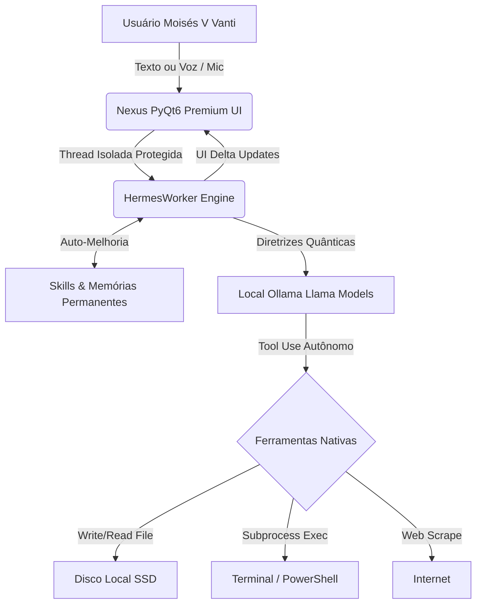

  
  <h1>NEXUS AGENT PREMIUM</h1>
  <h3><i>Powered by Hermes Engine</i></h3>

  

    
    
    
    
    
  

  
<b>Desenvolvido e Arquitetado Exclusivamente por Moisés V Vanti</b>

 

---

## 🌌 Visão Geral

O **Nexus Agent** é uma Inteligência Artificial local de altíssimo nível, desenhada para atuar como um Arquiteto de Software Sênior e Operador de Sistemas autônomo. Rodando 100% offline em sua própria máquina (integrado ao motor do Ollama), o Nexus é blindado contra vazamentos de dados, oferecendo a você um assistente capaz não apenas de responder a perguntas, mas de assumir o controle total do ecossistema de arquivos do seu PC para projetar, codificar, auditar e implementar sistemas gigantescos de ponta a ponta sem interrupções.

O projeto embute o inigualável **Motor Hermes**, permitindo processamento lógico sequencial profundo com até 100 ciclos autônomos.

---

## ⚡ Capacidades de Extremo Avanço

O Nexus Agent **não é um chatbot.** É um Engenheiro Digital Autônomo com reflexo cognitivo. Eis do que ele é capaz:

- 🏗️ **Construção Integral e Implacável:** Peça *"crie um aplicativo web de finanças"* e o Nexus não te dará um esqueleto inútil. Ele assumirá o terminal, criará os diretórios, construirá o Frontend, codificará o Backend, injetará as lógicas de roteamento e os estilos, parando **apenas** quando todo o sistema estiver funcional e pronto para uso.
- 🎙️ **Comando por Voz Multithread (STT/TTS):** Abandone o teclado se quiser. Fale com o Nexus via microfone; o sistema usa reconhecimento de fala avançado (`speech_recognition`) para transcrever seu áudio e processa respostas audíveis via sistema `pyttsx3`, com fluxos multithreads que não congelam sua tela.
- 🧠 **Auto-Aperfeiçoamento Constante:** Equipado com diretrizes de aprimoramento nativo (`skill_manage`), o Nexus aprende com os próprios erros. Sempre que você o corrigir, ele gravará uma *Skill de Reflexão* permanentemente na própria base de dados do cérebro. O agente de hoje será menos inteligente que o de amanhã.
- 🛡️ **Modo CyberStrike Ofensivo:** Conta com uma suíte de conhecimentos hacker acoplada. Se instruído a caçar vulnerabilidades de redes, buscar brechas em sistemas web (XSS, SQL Injection) ou realizar Pentests locais, ele acessará seu arsenal e executará testes rigorosos.
- 🚀 **Instalador Launcher Inception:** O executável se instala sozinho. Ao ser rodado pela primeira vez, ele abre uma interface Premium Setup que copia si mesmo silenciosamente para o Desktop e levanta as configurações locais, transformando-se num Launcher definitivo na segunda vez.
- 📑 **Histórico Moderno e Fixo:** Gerencie suas conversas com menus suspensos avançados (os famosos "Três Pontinhos"). Renomeie, fixe `📌` seus papos mais importantes no topo, ou delete conversas para sempre do seu SSD em um clique.

---

## 🔒 Segurança Lógica: O Nexus pode deletar ou destruir meu PC?

A arquitetura de segurança do Nexus foi desenhada com diretrizes paranoicas.

> [!CAUTION]
> **Devo ter medo dele agir sem minha permissão ou apagar meu HD?**  
> **NÃO.** O Nexus opera sob restrições lógicas rigorosas.

1. **Isolamento de Área de Trabalho (Workspace):** O Agente é instruído e restringido à pasta do projeto que você definir. Ele atua como um trator *dentro daquele cercado*. 
2. **Validação Matemática Silenciosa:** Antes de lhe dizer que alterou um arquivo ou apagou um bug, o Nexus é obrigado pelo `sys_prompt` a realizar um ciclo de Engenharia Reserva: `write_file` -> `read_file` -> `diff check`. Ele lê novamente o arquivo no HD para confirmar com matemática computacional que o código está íntegro antes mesmo de te dar uma resposta no chat.
3. **Privacidade Absoluta:** O peso do raciocínio (Inferência LLM) ocorre na sua placa de vídeo ou processador local. Nenhum byte do seu projeto é enviado a servidores na nuvem. Você tem posse soberana e criptográfica da inteligência do robô.

---

## 🛠️ Arquitetura do Sistema e Fluxo Nervoso

---

## 💻 Guia de Instalação Rápida

1. **Baixe o Software**:
   - Obtenha o executável oficial blindado **`NexusAgente.exe`** disponibilizado pelo desenvolvedor.
2. **O Setup Inception**:
   - Dê dois cliques no `.exe`. A tela inicial de *Setup* se abrirá automaticamente.
   - Pressione **"⚙️ Instalar na Área de Trabalho"**. O sistema clonará a si próprio de forma nativa e segura para dentro do seu sistema e criará o atalho oficial de lançamento na sua Área de Trabalho.
3. **Produção**:
   - Use o atalho **Nexus Agent** na Área de Trabalho para abrir o Launcher.
   - Clique em **🚀 Launch Nexus Agent**.
   - Defina sua Área de Trabalho (o laboratório dele).
   - Inicie o desenvolvimento quântico.

---

 

  
<i>"O limite do desenvolvimento é apenas o limite da sua comunicação com a máquina."</i>

  <b>— Moisés V Vanti</b>

